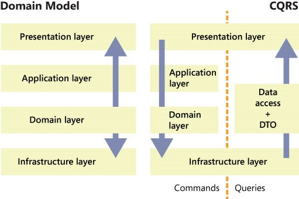

https://habr.com/ru/companies/productivity_inside/articles/505430/ - SOLID в картинках

https://habr.com/ru/articles/811305/ - SOLID тезисно

https://habr.com/ru/articles/809831/ - DDD

https://habr.com/ru/articles/672328/ - луковичная архитектура

https://habr.com/ru/companies/timeweb/articles/771338/ - гексагональная архитектура

https://habr.com/ru/articles/682424/ - Event Modeling

>Да, в CQRS мы разделяем read и write потоки, но во первых это делается с целью оптимизации нагрузки и новички обычно этим не занимаются, а во вторых, все описанные архитектурные шаблоны (Слои, Луковицы, Гексогоны, Порты и Адаптеры) относятся к write потоку. То есть CQRS это скорей надстройка над архитектурой чем замена.