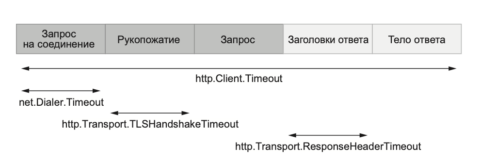

1. Запрос на установление TCP-соединения.
2. TLS-рукопожатие (TLS handshake — если оно включено).
3. Отправка запроса.
4. Чтение заголовков ответа.
5. Чтение тела ответа.



Пять шагов HTTP-запроса и соответствующие тайм-ауты

Применение:

```go
	client := &http.Client{
		Timeout: 5 * time.Second,
		Transport: &http.Transport{
			DialContext: (&net.Dialer{
				Timeout: time.Second,
			}).DialContext,
			TLSHandshakeTimeout:   time.Second,
			ResponseHeaderTimeout: time.Second,
		},
	}
```

Какие ещё настройки можно оптимизировать:

```go
http.Transport.DisableKeepAlives
http.Transport.IdleConnTimeout
http.Transport.MaxIdleConns
http.Transport.MaxIdleConnsPerHost
```
