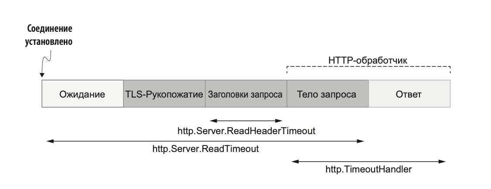

1. Ожидания запроса клиента.
2. TLS-рукопожатие (TLS handshake — если оно включено).
3. Чтение заголовков запроса.
4. Чтение тела запроса.
5. Отправка ответа.

ПРИМЕЧАНИЕ TLS-рукопожатие не нужно повторять при уже установ- ленном соединении.



Пять шагов HTTP-ответа и соответствующие тайм-ауты

```go
	s := &http.Server{
		Addr:              ":8080",
		ReadHeaderTimeout: 500 * time.Millisecond,
		ReadTimeout:       500 * time.Millisecond,
		Handler:           http.TimeoutHandler(handler, time.Second, "foo"),
	}
```

`http.TimeoutHandler` пришёл на замену `http.Server.WriteTimeout`, у которого были проблемы

Какие ещё настройки можно оптимизировать:

```go
http.Server.disableKeepAlives
http.Server.IdleTimeout
```
