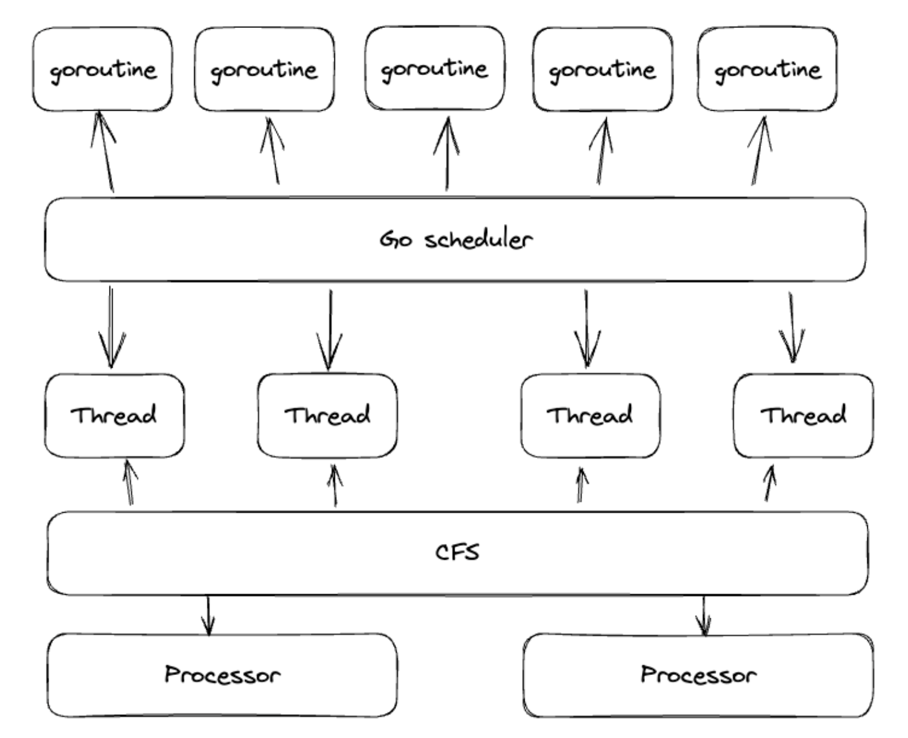
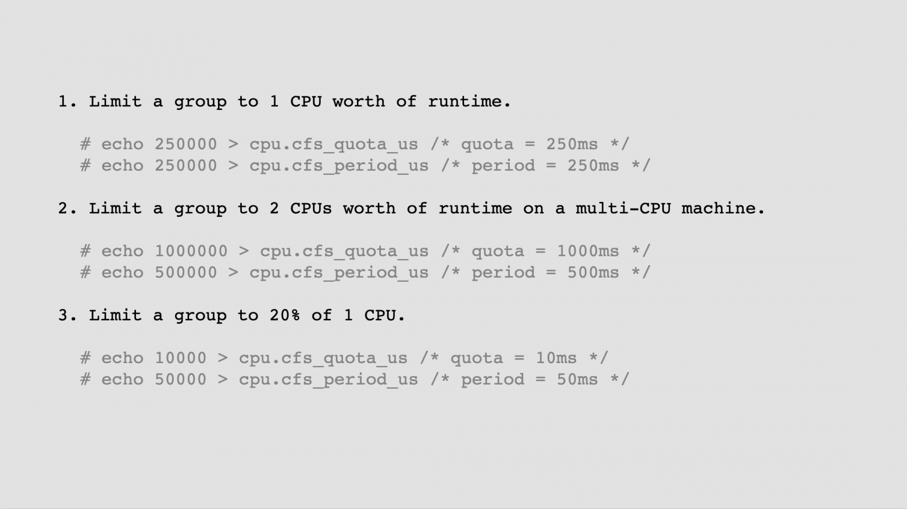

https://youtu.be/MHn-taXfQ8o?t=3748

Определения в контексте Kubernetes:

- **CFS (Completely Fair Scheduler)**: Это планировщик процессов, реализованный Ingo Molnar и включенный в Linux 2.6.23. Он заменил код интерактивности предыдущего планировщика SCHED_OTHER. CFS моделирует \"идеальный, точный многозадачный процессор\" на реальном оборудовании. Основная логика выбора задач CFS основана на значении p->se.vruntime, и она очень проста: всегда пытается запустить задачу с наименьшим значением p->se.vruntime (то есть задачу, которая выполнялась меньше всего).

- **GMP**: В контексте Kubernetes я не нашел определение для GMP. Возможно, вы имели в виду другой термин или акроним.

- **CPU & MEM Limits**: В Kubernetes вы можете указать ограничения на использование ресурсов для каждого контейнера в поде, включая CPU и память. Ограничения на CPU и память определяют максимальное количество ресурсов, которые контейнер может использовать.

- **Containers**: Контейнеры - это стандартизированные исполняемые компоненты, которые объединяют исходный код приложения с библиотеками операционной системы. В Kubernetes каждый контейнер изолирован от других процессов и работает на компьютере, физическом сервере или виртуальной машине.

- **Pods**: Поды - это наименьшие развертываемые единицы вычислений, которые вы можете создать и управлять в Kubernetes. Под (как стая китов или стручок гороха) - это группа из одного или нескольких контейнеров с общим хранилищем и сетевыми ресурсами, а также спецификацией того, как запускать контейнеры.

- **Nodes**: Узел - это рабочая машина в Kubernetes и может быть виртуальной или физической машиной, в зависимости от кластера. Каждый узел управляется планом управления и содержит услуги, необходимые для запуска подов.

- **Requests**: Запросы обычно используются для определения среднего потребления. Когда вы указываете запрос на ресурсы для контейнеров в поде, планировщик Kubernetes использует эту информацию, чтобы решить, на каком узле разместить под.

---

При администрировании кластера Kubernetes администратор может настроить два параметра:

```
cpu.cfs_period_us (глобальная установка);
cpu.cfs_quota_us (установка для каждого пода).
```

[runtime: make GOMAXPROCS cfs-aware on GOOS=linux](https://github.com/golang/go/issues/33803) - на сегодня проблему решает uber-go/automaxprocs

Рекомендации:

- Requests: всегда определяйте CPU & MEM requests
- CPU Limits: использовать в связке с GOMAXPROCS (иначе тротлятся)
- MEM Limits: выставлять равным requests (иначе убиваются)
- Мониторить CPU Throttling ваших контейнеров
- Всегда контролируйте значение GOMAXPROCS
- Оптимальный GOMAXPROCS всегда зависит от вашего контекста
- Выставляйте целые числа в CPU Limit
- Пробуйте разные значения, пока не найдёте оптимальную комбинацию:
  - Server Latency (50, 90, 99, 99.9 персентили)
  - CPU Usage
  - GC Duration

---

- [Как использовать ресурсы Kubernetes по максимуму для работы с Go-приложениями](https://habr.com/ru/companies/sbermarket/articles/773648/)

Выкатывается приложение буквально одной командой kubectl apply, что очень удобно. Плюс, можно масштабировать как индивидуальное приложение — с помощью HPA (Horizontal Pod Autoscaling), так и сам кластер, — с помощью CA (Cluster Autoscaling), увеличивая количество нод по мере потребности.

CFS (Completely Fair Scheduler) берет задачи, которые были исполнены на процессоре минимальное количество времени, вытаскивает их из левой части дерева, исполняет на процессоре и потом возвращает в правую часть дерева. Таким образом происходит движение задач по дереву и равномерное по длительности исполнение каждой задачи.

А что если мы не хотим, чтобы все процессы в нашей системе имели одинаковый приоритет? Для таких случаев был придуман прекрасный механизм под названием Cgroups.

Cgroups (Control Group) — это механизм для организации процессов в иерархию и контролируемого распределения ресурсов по этой иерархии в соответствии с конфигурацией. Эта иерархия представляет из себя дерево. В нём в каждой группе выделяется какое-то количество ресурсов, которыми эта группа может пользоваться. Механизм Сgroups — это основа для контейнеризации приложений.

> Важно понимать, что планировщик не будет размещать под с Requests, которые превышают этот остаточный Capacity на ноде. Соответственно, если Capacity на одной ноде не хватает, значит планировщик пойдет на другую ноду. Если свободных нод не найдено, тогда планировщик с помощью механизма Cluster autoscaling создаст новую ноду и там разместит под.



CFS Bandwidth Control — это механизм, который позволяет определять потолок CPU, используемого группой (Cgroup). Механизм заключается в том, что Cgroup выдается квота (Quota) процессорного времени за определенный отрезок времени (Period). Когда вся квота использована, потоки в группе ограничиваются, или тротлятся (Throttle), что значит, что они не будут исполняться на процессоре остаток этого периода (Period). Как только исчерпана квота за один период, нужно ждать следующего периода, когда можно будет пользоваться новой квотой.



Limits нужны для выставления жестких порогов утилизации ресурсов контейнерами. При достижении этих порогов по процессору контейнер будет тротлиться, а по достижению лимитов по памяти контейнер будет останавливаться.

Оптимизируем ресурсы Kubernetes:

✅ Всегда определяйте CPU, Memory Requests. Это нужно для более эффективного использования ресурсов.

✅ CPU Limits используйте в связке с GOMAXPROCS. Всегда нужно контролировать, сколько CPU Limits, сколько GOMAXPROCS сейчас приложение использует.

✅ Memory Limits выставляйте равными Requests. Это поможет избежать выселений подов с одной ноды на другую.

✅ Мониторьте CPU Throttling ваших контейнеров. Это поможет выявлять проблемы с производительностью на ранних стадиях.

Для Go-приложений:

✅ Всегда контролируйте значение GOMAXPROCS

✅ Оптимальный GOMAXPROCS всегда зависит от вашего контекста, у каждого приложения свой профиль нагрузки

✅ Пробуйте разные значения, деплойте их на проде, пока не найдете оптимальную комбинацию. Во время эскпериментов, смотрите и анализируйте графики по:

— Server Latency (50, 90, 99, 99.9 персентили)
— CPU Usage
— GC Duration

Выставляя оптимальные значения, мы оптимизируем бюджет на Kubernetes и делаем его более предсказуемым, а также повышаем производительность Go приложений в целом.

---

Service Mesh - это специализированный слой инфраструктуры, предназначенный для облегчения общения между сервисами или микросервисами. В отличие от других систем управления этим общением, Service Mesh является выделенным слоем инфраструктуры, встроенным прямо в приложение.

Service Mesh обеспечивает следующие функции:

- Оптимизация общения между различными частями приложения.
- Маршрутизация запросов от одного сервиса к другому.
- Обеспечение безопасного общения между сервисами.
- Сбор метрик, таких как задержка, частота ошибок и использование ресурсов.
- Выполнение распределенного трассирования для просмотра полного пути и времени запросов через несколько сервисов.
- Регистрация событий сервиса в журналах для аудита, отладки и соблюдения требований к соблюдению нормативных требований.

Service Mesh обычно используется в распределенных системах, состоящих из микросервисов.

---

[Kubernetes 1.28: sidecar-контейнеры возвращаются?](https://habr.com/ru/companies/vk/articles/772574/)


--- 

Kubernetes

- Удобство
  - Абстракция над физическими или виртуальными машинами
  - Выкатка приложений одной командой (kubectl apply)
- Масштабируемость
  - HPA - горизонтальное масштабирование подов
  - CA - cluster autoscaling - горизонтальное масштабирование нод

Но иногда это...

- CPU Throttling
- Container Evicted (MemoryPressure)
- Зашкаливающие 99 персентили по длительности ответа сервера
- Непредсказуемое масштабирование кластера
- Или наоборот - простаивающие ресурсы на нодах с потреблением CPU, Memory менее 50%

---

На данный момент нет широко известной библиотеки, аналогичной uber-go/automaxprocs для автоматической настройки GOMEMLIMIT. GOMAXPROCS обычно настраивается для оптимизации использования CPU, тогда как GOMEMLIMIT относится к управлению памятью, и автоматическая настройка может быть более сложной из-за разнообразия требований к памяти разных приложений.

Для автоматизации подбора GOMEMLIMIT, вы можете рассмотреть написание собственного скрипта или программы, которая будет:

1. Запускать ваше приложение с различными значениями GOMEMLIMIT.
2. Мониторить использование памяти и производительность.
3. Определять оптимальное значение на основе собранных данных.

Этот процесс может включать в себя тестирование под нагрузкой и анализ результатов для разных сценариев использования вашего приложения. Ключевыми метриками для анализа могут быть производительность, задержка и потребление памяти.

Для сбора и анализа данных можно использовать библиотеки и инструменты, такие как pprof для профилирования памяти в Go, а также различные системы мониторинга и анализа производительности.

Написание подобного инструмента потребует глубокого понимания работы вашего приложения и его требований к памяти, а также может потребовать постоянной настройки и адаптации под изменения в приложении.

--- 

Automatically set GOMEMLIMIT to match Linux cgroups(7) memory limit. https://github.com/KimMachineGun/automemlimit