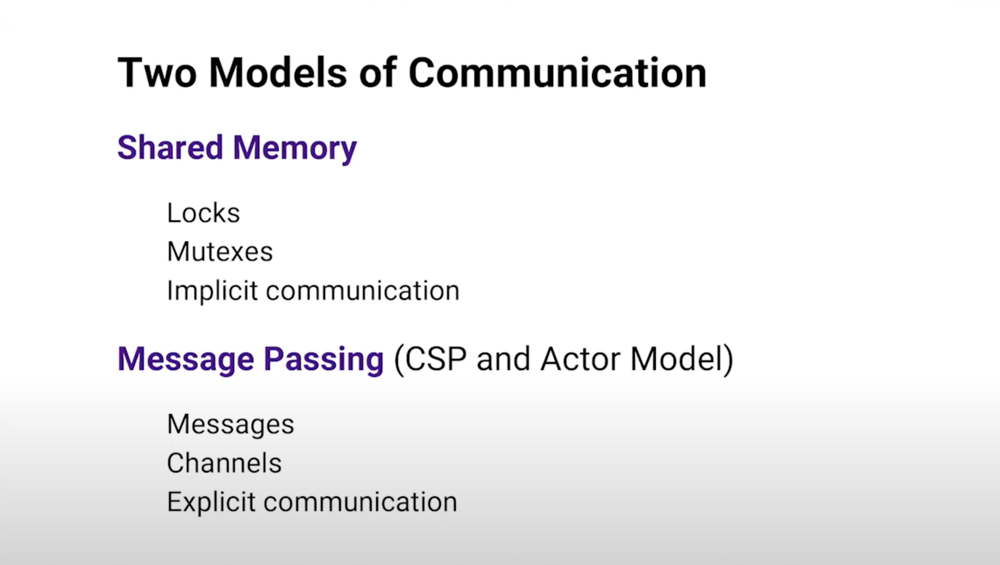
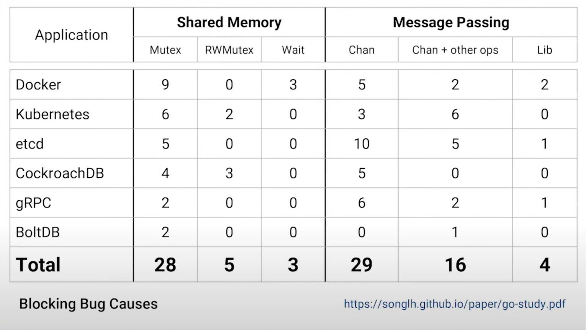
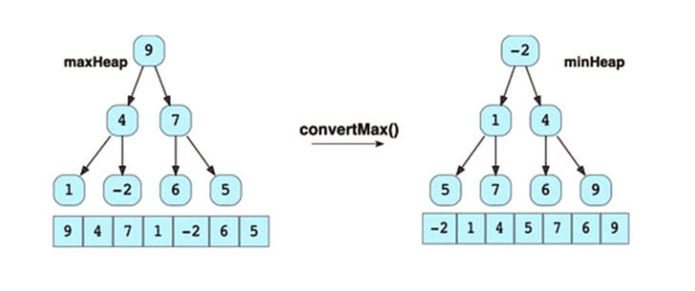
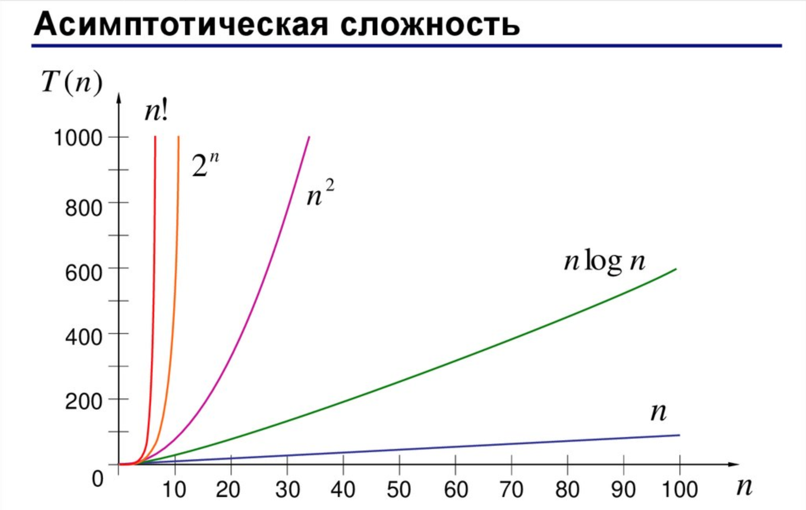

# yandex

## Почему Go?

Это матерный язык в мире языков программирования, где простыми выразительными средствами можно сказать больше, чем на родном языке. Плюс gofmt снимает ограничения с выбором редактора.

- [Дзен Go](https://habr.com/ru/companies/vk/articles/490340/)
- [The Zen of Go](https://the-zen-of-go.netlify.app/)
- [Изучите X за Y минут Где X=Go](https://learnxinyminutes.com/docs/ru-ru/go-ru/)
- [A Tour of Go](https://go.dev/tour/list)
- [Golang | Все Основы за 4 Часа Для Начинающих](https://www.youtube.com/watch?v=h0zxh2TPN_I)
- [Go в примерах](https://gobyexample.com.ru/)
- [Курс Go: онлайн обучение с нуля](https://code-basics.com/ru/languages/go)
- [Курс по изучению Golang для начинающих](https://golangify.com/go/kurs-izucheniya-golang-dlya-nachinayuschih)
- [golang-book.ru](http://golang-book.ru/)
- [Effective Go (RU)](https://github.com/Konstantin8105/Effective_Go_RU)
- [roadmap](https://roadmap.sh/golang)
- [Шпаргалка для собеса по GoLang](https://habr.com/ru/articles/758662/)
- [Практика Go — Основы](https://habr.com/ru/articles/759378/)
- [Практика Go — Concurrency](https://habr.com/ru/articles/759584/)
- [Практика Go — Обработка ошибок (1 часть)](https://habr.com/ru/articles/759840/)
- [Практика Go — Обработка ошибок (2 часть)](https://habr.com/ru/articles/759920/)
- [Планирование в Go: Часть III — Конкурентность](https://habr.com/ru/articles/761606/)
- [Конкурентность — это не параллелизм](https://habr.com/ru/articles/761754/)
- [Ошибки это значения](http://habrahabr.ru/post/269909/)
- [Почему «ошибки это значения» в Go](https://habr.com/ru/articles/270027/)
- [ШБР 2023](https://www.youtube.com/watch?v=SGhdeWlgPTo&list=PLZvfMc-lVSSO2zhyyxQLFmio8NxvQqZoN)
- [Лайфхаки для кода без побочных эффектов: пишем на Go и красиво, и правильно](https://www.youtube.com/watch?v=G-lhh_1XNcI)
- [Оптимизация памяти и управление сборщиком мусора в Go: GOGC и GOMEMLIMIT](https://habr.com/ru/articles/742402/)
- [Go To Memory](https://habr.com/ru/companies/oleg-bunin/articles/676332/)
- [Understanding Real-World Concurrency Bugs in Go](https://songlh.github.io/paper/go-study.pdf)
- [Interfaces in Go](https://go101.org/article/interface.html)
- [Туториал по дженерикам в Go](https://kovardin.ru/articles/go/generics/)
- [DataDog/go-profiler-notes](https://github.com/DataDog/go-profiler-notes)
- [Go Developer Survey 2021 Results](https://go.dev/blog/survey2021-results)
- [Лекции для мидлов в OZON](https://www.youtube.com/@go_developer/videos)

## Code Style

- [What's in a name?](https://go.dev/talks/2014/names.slide)
- [uber-go-guide-ru](https://github.com/sau00/uber-go-guide-ru/blob/master/style.md)
- [Standard Go Project Layout](https://github.com/golang-standards/project-layout)
- [Organizing a Go module](https://go.dev/doc/modules/layout)
- [50 оттенков Go](https://habr.com/ru/companies/vk/articles/314804/)
- [Паттерны проектирования (с картинками)](https://refactoring.guru/ru/design-patterns/go)
- [Паттерны проектирования (с тестами)](https://github.com/AlexanderGrom/go-patterns)
- [Go Clean Architecture](https://github.com/comerc/go-clean-architecture)
- [Communicating sequential processes(CSP) for Go developer in a nutshell](https://levelup.gitconnected.com/communicating-sequential-processes-csp-for-go-developer-in-a-nutshell-866795eb879d)
- [Как не ошибиться с конкурентностью в Go](https://habr.com/ru/companies/avito/articles/466495/)
- [Как избежать применения ORM для Go, используя чистый SQL](https://highload.today/kak-izbezhat-primeneniya-orm-dlya-go-ispolzuya-sql/)
- [Go Concurrency Patterns](https://github.com/lotusirous/go-concurrency-patterns)
- [Go Concurrency Exercises](https://github.com/comerc/go-concurrency-exercises)
- [Как не наступать на грабли в Go](https://habr.com/ru/articles/325468/)
- Web Frameworks: [Revel](https://github.com/revel/revel)  12.2011 > [Gin](https://github.com/gin-gonic/gin)  06.2014 > [Echo](https://github.com/labstack/echo)  03.2015 > [Fiber](https://github.com/gofiber/fiber)  01.2020
- [Тёмные века программного обеспечения](https://github.com/comerc/software_dark_ages/blob/main/TEXT.md)
- [Событийное моделирование традиционных систем](https://github.com/comerc/event_modeling_traditional_systems/blob/main/TEXT.md)
- [Event Modeling Cheat Sheet](https://eventmodeling.org/posts/event-modeling-cheatsheet/)
- [Зачем нужны модульные тесты и как заставить их работать на вас](https://habr.com/ru/articles/767858/)
- [Масштабирование приёмочных тестов](https://habr.com/ru/articles/765996/)
- [Работа без имитаторов](https://habr.com/ru/articles/765956/)
- [Введение в приёмочные тесты](https://habr.com/ru/articles/765892/)
- [Антипаттерны в TDD](https://habr.com/ru/articles/767874/)
- [Idiomatic Go](https://dmitri.shuralyov.com/idiomatic-go)
- [Go Patterns](https://github.com/tmrts/go-patterns)
- [Проблемы функции Golang init](https://habr.com/ru/articles/771858/)
- [Методические рекомендации по написанию Go кода от Uber](https://github.com/sau00/uber-go-guide-ru/blob/master/style.md)
- [Создание атомарных коммитов в Git](https://habr.com/ru/articles/781794/)
- [«Программист-прагматик. Путь от подмастерья к мастеру»: коротко о главном (часть первая)](https://habr.com/ru/companies/productivity_inside/articles/348116/)
- [«Программист-прагматик. Путь от подмастерья к мастеру»: коротко о главном (часть вторая)](https://habr.com/ru/companies/productivity_inside/articles/348932/)
- [Golang design: Generics vs Interfaces, How It Really Works Under the Hood](https://blog.stackademic.com/golang-design-generics-vs-interfaces-how-it-really-works-under-the-hood-c1e5057a7ae6?gi=fa683ee6f9d1)
- [Go Style Decisions](https://google.github.io/styleguide/go/decisions.html)

## Channel Axioms

- Отправка на nil-канал блокируется навсегда (fatal error "deadlock" без recover)
- Приём от nil-канала блокируется навсегда (fatal error "deadlock" без recover)
- Отправка в закрытый канал приводит к панике (можно обработать recover)
- Приём из закрытого канала немедленно возвращает нулевое значение (широкополосно, т.е. всем слушателям канала)

## Go Proverbs

В мире Go существуют несколько известных "пословиц" или принципов, которые отражают философию языка и его лучшие практики. Вот некоторые из них:

Правило компиляции: "Компилируется всё". Go стремится быть языком с хорошей статической типизацией и строгим компилятором, который помогает выявлять ошибки на этапе компиляции.

Правило эффективности: "Каналы, а не разделяемая память, для общения между горутинами". Go поощряет использование каналов для координации и обмена данными между горутинами, а не общую память, чтобы избежать состояния гонки и других проблем синхронизации.

Правило читаемости: "Код должен быть понятен для людей, а не для машин". Go ставит акцент на читаемость кода и призывает разработчиков писать чистый, понятный и простой код, который легко поддерживать и понимать.

Правило простоты: "Простота лучше сложности". Go стремится к простоте в дизайне языка и стандартной библиотеке, чтобы программистам было легче писать, читать и поддерживать код.

Правило проверки ошибок: "Проверка ошибок обязательна и должна быть явной". Go призывает разработчиков явно проверять ошибки и обрабатывать их, чтобы предотвратить возможные проблемы и улучшить надежность программ.

Правило однозначности: "Чётко выражайте свои намерения". Go ставит акцент на ясное и однозначное выражение намерений в коде, чтобы избежать двусмысленности и улучшить его понимание.

Правило соблюдения стандартов: "Всегда следуйте соглашениям о форматировании кода". Go имеет строгие соглашения о форматировании кода, определенные в стандартной библиотеке, и призывает разработчиков следовать им для повышения согласованности и читаемости кода.

Эти принципы отражают философию Go и помогают разработчикам создавать безопасные, эффективные и понятные программы.

[Ещё](http://go-proverbs.github.io/) [Постулаты Go](https://habr.com/ru/articles/272383/)

## Dependency Injection

**Inversion of Control** (IoC) и **Dependency Injection** (DI) - это два взаимосвязанных принципа, используемые в разработке программного обеспечения для уменьшения связанности и улучшения модульности кода.

IoC - это общий принцип, который говорит о том, что пользовательский код не должен самостоятельно управлять потоком выполнения. Вместо этого поток управления обрабатывается централизованным или внешним сервисом. Это означает, что объекты не создают другие объекты, на которые они полагаются для работы. Вместо этого они получают объекты, которые им нужны, от внешнего источника.

DI - это конкретная форма IoC, где зависимости предоставляются внешним сервисом. DI позволяет нам разрабатывать слабо связанные модули. Внедрение зависимостей осуществляется путем предоставления зависимости объекту (клиенту), а не путем создания зависимости внутри объекта.

Таким образом, можно сказать, что DI - это способ реализации IoC. Они оба работают вместе для достижения слабой связанности и лучшей модульности в коде.

- [Dependency Injection на примере Uber fx](https://www.youtube.com/watch?v=KRdrH9a98HQ)
- [Методы организации DI и жизненного цикла приложения в GO](https://habr.com/ru/companies/vivid_money/articles/531822/)

Не путать с **Dependency Inversion Principle** - это принцип SOLID в объектно-ориентированном программировании, который помогает уменьшить связанность в коде. Он гласит: "Модули верхнего уровня не должны зависеть от модулей нижнего уровня. Оба должны зависеть от абстракций. Абстракции не должны зависеть от деталей. Детали должны зависеть от абстракций".

## Упражнение на "Communicating sequential processes (CSP)" / "Actor Model"




"Don't communicate by sharing memory, share memory by communicating"

Задача: Реализовать структуру-счетчик, которая будет инкрементироваться в конкурентной среде. По завершению программа должна выводить итоговое значение счетчика.

Условие: Без применения примитивов из пакета sync, исключительно используя канал для обеспечения потокобезопасной передачи/приёма данных.

<details>
	<summary>Решение</summary>

```go
package main

import (
	"context"
	"fmt"
	"os"
	"os/signal"
	"sync"
)

type Counter chan int

func NewCounter(ctx context.Context) Counter {
	counter := make(Counter)
	go func() {
		var count int
		for {
			select {
			case v := <-counter:
				count += v
			case counter <- count:
			case <-ctx.Done():
				return
			}
		}
	}()
	return counter
}

func main() {
	ctx, cancel := signal.NotifyContext(context.Background(), os.Interrupt)
	defer cancel()
	counter := NewCounter(ctx)
	var wg sync.WaitGroup
	const total = 1_000_000
	wg.Add(total)
	for i := 0; i < total; i++ {
		go func() {
			counter <- 1
			wg.Done()
		}()
	}
	wg.Wait()
	fmt.Println(<-counter)
}
```

</details>

## Буферизированный-небуферизированный канал

- `ch := make(chan string)` - блокирует передатчик, пока не готов приёмник
- `bufferedCh := make(chan string, 1)` - неблокирует передатчик, пока не готов приёмник

```go
package main

import "fmt"

func main() {
	ch := make(chan string, 0) // Переключение на буферизированный канал изменит поведение
	go func() {
		msg := <-ch
		fmt.Println("Получено сообщение:", msg)
	}()
	ch <- "Привет, мир!" // Эта строка блокируется до тех пор, пока горутина не прочитает значение из канала
	fmt.Println("Главная горутина завершена")
}
```

## Каналы: more writers - one reader

```go
package main

import (
	"fmt"
	"time"
)

func main() {
	ch := make(chan int)
	done := make(chan bool)

	go func() {
		for i := range ch {
			if i == 20 {
				done <- true
				return
			}
			fmt.Printf("%d\n", i)
		}
	}()

	go func() {
		for i := 0; i < 10; i++ {
			select {
			case ch <- i:
				time.Sleep(1 * time.Second)
			case <-done:
				return
			}
		}
	}()

	go func() {
		for i := 10; i <= 20; i++ {
			select {
			case ch <- i:
				time.Sleep(1 * time.Second)
			case <-done:
				return
			}
		}
	}()

	<-done

}
```

## Каналы: one writer - more readers

```go
package main

import (
	"fmt"
	"time"
)

func main() {
	ch := make(chan int)
	done := make(chan bool)

	go func() {
		for i := range ch {
			fmt.Printf("reader1: %d\n", i)
		}
		done <- true
	}()

	go func() {
		for i := range ch {
			fmt.Printf("reader2: %d\n", i)
		}
		done <- true
	}()

	go func() {
		for i := range ch {
			fmt.Printf("reader3: %d\n", i)
		}
		done <- true
	}()

	for i := 0; i <= 300; i++ {
		if i == 300 {
			close(ch)
			return
		}
		time.Sleep(1 * time.Second)
		ch <- i
	}

	<-done
}
```

## Practice

- [go-in-practice](https://github.com/diptomondal007/GoLangBooks/blob/master/go-in-practice.pdf)
- [building-microservices-go](https://github.com/diptomondal007/GoLangBooks/blob/master/building-microservices-go.pdf)
- [go-design-patterns-real-world-projects](https://github.com/diptomondal007/GoLangBooks/blob/master/Go_Design_Patterns_for_Real_World_Projects/go-design-patterns-real-world-projects.pdf)

## ООП

В GoLang не реализованы некоторые особенности объектно-ориентированного программирования, такие как наследование классов и конструкторы. Однако, Go предлагает другие механизмы для достижения тех же целей, например, встраивание структур и интерфейсы.

Инкапсуляция достигается с помощью именованных и неименованных идентификаторов (публичные и приватные). Идентификаторы, начинающиеся с заглавной буквы, являются публичными и могут быть доступными из других пакетов. Идентификаторы, начинающиеся с маленькой буквы, являются приватными и доступны только в пределах своего пакета. Однако, в Go нет строгой приватности, и другие пакеты могут иметь доступ к приватным идентификаторам, если они находятся в том же пакете импорта.

Полиморфизм достигается через интерфейсы. Интерфейсы в Go позволяют создавать общие типы данных, которые могут быть реализованы разными конкретными типами. Это позволяет использовать эти типы данных в общем контексте и вызывать их методы без необходимости знать конкретную реализацию. Таким образом, в GoLang можно достичь полиморфизма, хотя это не основной акцент данного языка.

Есть поддержка абстракции через интерфейсы. Интерфейсы в Go позволяют определить набор методов, которые должны быть реализованы для типа данных. Это позволяет создавать абстрактные типы данных и работать с ними, не завися от конкретной реализации.

Объявление или привязка структуры к методу называется "методом-получателем" (method receiver). При объявлении метода для структуры, указывается получатель - тип структуры, к которому привязывается метод. Это позволяет вызывать методы на экземплярах этой структуры.

## А-ля статический метод

Вызов метода на nil указателе - валидная операция. А вот если метод попытается обратиться к данным (не методам) объекта, то вот тут и будет "nil dereference".

```go
package main

import "fmt"

type MyStruct struct {
	data string
}

func (m *MyStruct) PrintData() {
	if m != nil {
		fmt.Println(m.data)
	} else {
		fmt.Println("nil dereference")
	}
}

func main() {
	var ptr *MyStruct = nil
	ptr.PrintData() // вызов метода на nil указателе
}
```

## Термины

- [0-15) полуинтервал на числовую прямую
- компоратор - функция, которая возвращает -1 || 0 || 1
- ресивер – это объявление типа, для которого вы хотите определить метод.

## Указатели

- `*` - разыменование указателя (пример: a := \*b), но для арументов функции - тип указателя
- `&` - взятие адреса (пример: a := &b - положить в переменную указатель на значение)

- в Gо нет ссылок, только указатели (ссылки есть в c/c++).
- у переменой есть значение, адрес ссылки это адрес значения, а указатель на значение имеет свой собственный адрес (​это очень грубое объяснение).

- представим дом, стоящий на пересечении улиц Ленина 43 и Менделеева 77, тогда мы можем заказать такси на любой из этих адресов и оно приедет в одно и то же место. это адрес. можно сказать что адрес это второе имя переменной, а указатель это коробка при открытии которой нам скажут по какому адресу лежит значение. указатель нужно разыменовывать. адрес нет.

[Зачем в Go амперсанд и звёздочка (& и \*)?](https://habr.com/ru/articles/339192/)

## interface{}

- алиас any
- x.(MyType) - это "утверждение типа" / "type assertion" (а не "приведение типа", как например: float64 к int)
- x.(type) - это "извлечение типа" / "type extraction", работает только для `switch`, иначе так и называется "выбор типа" / "type switch"

## Множества (sets)

В языке Go множества (sets) не являются встроенной частью языка, в отличие от некоторых других языков программирования, таких как Python. Однако, вы можете достичь похожего поведения с помощью карты.

```go
type Set[V comparable] map[V]struct{}

func NewSet[V comparable](capacity int) Set[V] {
	return make(Set[V], capacity)
}

// or

func NewSetWithValue[V comparable](value ...V) Set[V] {
	set := make(Set[V], len(value))

	for _, v := range value {
		set[v] = struct{}{}
	}

	return set
}
```

## Кортежи (tuples)

В языке Go кортежи (tuples) не являются встроенной частью языка, в отличие от некоторых других языков программирования, таких как Python. Однако, вы можете достичь похожего поведения с помощью структур или слайсов.

С использованием структур, вы можете определить тип данных, который содержит несколько полей, которые могут быть разного типа. Например:

```go
type Tuple struct {
    Field1 int
    Field2 string
    Field3 float64
}

func main() {
    tuple := Tuple{Field1: 1, Field2: "Hello", Field3: 3.14}
    fmt.Println(tuple.Field1, tuple.Field2, tuple.Field3)
}
```

Вы также можете использовать слайсы (slices) для создания коллекции значений без явного определения структуры. Например:

```go
func main() {
    tuple := []interface{}{1, "Hello", 3.14}
    fmt.Println(tuple[0], tuple[1], tuple[2])
}
```

Однако, использование структур или слайсов вместо кортежей может быть менее удобным, так как вам может потребоваться обращаться к элементам по индексам или использовать дополнительные проверки типов.

## Функции-генераторы

В языке Go нет встроенной поддержки для функций-генераторов, как в некоторых других языках, таких как Python. Функции-генераторы позволяют создавать итераторы, которые могут генерировать значения по запросу, вместо того чтобы сразу возвращать все элементы.

Однако в Go можно использовать горутины и каналы для реализации подобного поведения. Вместо того, чтобы возвращать все значения сразу, вы можете использовать горутину для генерации значений и канал для передачи этих значений обратно вызывающей стороне.

Вот пример простой реализации функции-генератора в Go с использованием горутин и каналов:

```go
func generator() <-chan int {
	ch := make(chan int)
	go func() {
		defer close(ch)
		for i := 0; i < 10; i++ {
			ch <- i
		}
	}()
	return ch
}

func main() {
	gen := generator()
	for value := range gen {
		fmt.Println(value)
	}
}
```

В этом примере функция `generator` создает канал и запускает горутину, которая генерирует значения и отправляет их в канал. Функция возвращает канал, по которому можно итерироваться и получать значения.

Затем в функции `main` мы получаем канал из функции-генератора и используем цикл `for range` для получения значений из канала и вывода их на экран.

Это простой пример, и реализация функционала функций-генераторов может быть более сложной в зависимости от ваших требований. Однако с использованием горутин и каналов в Go вы можете достичь подобного поведения.

## Указательные типы данных

Указательные типы данных в GoLang - это типы данных, которые хранятся в системной куче (heap) и передаются по указателю, а не по значению. Это означает, что при передаче указательного типа данных в функцию, функция работает с оригинальным объектом, а не с его копией. Некоторые из указательных типов данных в GoLang:

- Срезы (slices) - это динамические массивы, которые представляют собой указатель на последовательность элементов определенного типа.
- Карты (maps) - это ассоциативные массивы, которые представляют собой указатель на набор пар ключ-значение.
- Каналы (channels) - это механизм для обмена данными между горутинами (goroutines) в многопоточной программе.
- Указатели (pointers) - это переменные, которые хранят адрес в памяти другой переменной.
- ?? Структуры (structs) - это пользовательские типы данных, которые могут содержать поля разных типов.
- Интерфейсы (interfaces) - это типы данных, которые определяют набор методов, которые должны быть реализованы для типа данных, чтобы он удовлетворял интерфейсу.
- Функции (functions) - это типы данных, которые могут быть переданы в качестве аргументов другим функциям или возвращены из функций.

Все эти типы данных являются указательными в GoLang и передаются по указателю, а не по значению.

Строки являются неизменяемыми, что означает, что вы не можете изменить строку напрямую, изменяя байты, на которые указывает строка. Хотя строки содержат указатели внутри своей структуры, сами строки не считаются указательными типами данных. Но, поскольку строка, как правило, является указателем, вызов функции для передачи строки не приводит к глубокому копированию байтов. Скопированная строка по-прежнему будет ссылаться на тот же резервный массив.

Поправка:

В GoLang тип данных `struct` является составным типом данных, который объединяет несколько полей разных типов данных в один объект. `struct` не является указательным типом данных, а является значимым типом данных, то есть при передаче `struct` в функцию или присваивании его переменной происходит копирование значений его полей. Однако, при передаче `struct` в функцию в качестве аргумента, происходит передача его копии, что может быть неэффективно для больших `struct`. В таких случаях можно использовать указатели на `struct`.

## Передача слайса как аргумента функции

Длина и вместимость передаются по значению, но массив значений передается по указателю. Вследствие этого получается неявное поведение: добавленные элементы не сохранятся в исходный слайс, но изменение существующих останется.

```go
package main

import "fmt"

func main() {
	cap := 4 // если 3, то ответы разные; если 4 - одинаковые
	var a = make([]int, 0, cap)
	a = append(a, 111, 222, 333)

	fmt.Printf("%#v\n", getArray(a))
	fmt.Printf("%#v\n", a)
}

func remove(slice []int, s int) []int {
	return append(slice[:s], slice[s+1:]...)
}

func getArray(a []int) []int {
	a = append(a, 444)
	a = remove(a, 0)
	return a
}
```

Общий формат среза: a[начало:конец:шаг]. Если начало не указано, то по умолчанию начало считается 0. Если конец не указан, то по умолчанию конец считается длиной массива. Если шаг не указан, то по умолчанию шаг считается равным 1.

Эмпирически установлено. Если отрезать слайс сначала, то capacity уменьшается до новой длины, а если с конца, то остаётся равен исходному размеру слайса. Третий параметр позволяет указать capacity явно (но не больше исходного), и он тоже уменьшается от указанного, если отрезать слайс сначала.

Если append() добавляет новый элемент в слайс, у которого превышена capacity, то capacity увеличивается в два раза от исходного. Но если добавлять за раз несколько элементов (больше чем в два раза от исходного), то дальше capacity увеличивается с шагом два.

Видео: [Что нужно знать о слайсах в Go](https://www.youtube.com/watch?v=1vAIvqDo5LE)

<details>
	<summary>Больше практики по слайсам</summary>

```go
package main

import (
	"fmt"
)

// что будет выведено?
// если где-то будет паника, то в какой сторке и почему?

func example1Slice() {
	var slice []int
	fmt.Printf("slice is nil %t\n", slice == nil) // true (!)
	slice2 := []int{}
	fmt.Printf("slice2 is nil %t\n", slice2 == nil) // false
	// append() увеличивает емкость среза в два раза:
	slice = append(slice, 1)
	fmt.Printf("slise = %+v len = %d; cap = %d;\n", slice, len(slice), cap(slice))
	// slise = [1] len = 1 cap = 1
	slice = append(slice, 2)
	fmt.Printf("slice = %+v len = %d; cap = %d;\n", slice, len(slice), cap(slice))
	// slise = [1, 2] len = 2 cap = 2
	slice = append(slice, 3)
	fmt.Printf("slice = %+v len = %d; cap = %d;\n", slice, len(slice), cap(slice))
	// slise = [1, 2, 3] len = 3 cap = 4 (!)
}

func example2Slice() {
	sl := []int{1, 2, 3, 4, 5, 6}
	sl1 := sl[:3]
	sl2 := sl[1:3:4]

	fmt.Printf("sl1 = %+v len = %d; cap = %d;\n", sl1, len(sl1), cap(sl1))
	// sl1 = [1, 2, 3] len = 3 cap = 6
	fmt.Printf("sl2 = %+v len = %d; cap = %d;\n", sl2, len(sl2), cap(sl2))
	// sl2 = [2, 3] len = 2 cap = 3

	sl2 = append(sl2, 9)
	sl1 = sl1[:4]

	fmt.Printf("sl = %+v len = %d; cap = %d;\n", sl, len(sl), cap(sl))
	// sl = [1, 2, 3, 9, 5, 6] len = 6 cap = 6
	fmt.Printf("sl1 = %+v len = %d; cap = %d;\n", sl1, len(sl1), cap(sl1))
	// sl1 = [1, 2, 3, 9] len = 4 cap = 6
	fmt.Printf("sl2 = %+v len = %d; cap = %d;\n", sl2, len(sl2), cap(sl2))
	// sl2 = [2, 3, 9] len = 3 cap = 3

	add(sl1, 8)
	fmt.Printf("sl = %+v len = %d; cap = %d;\n", sl, len(sl), cap(sl))
	// sl = [1, 2, 3, 9, 8, 6] len = 6 cap = 6
	fmt.Printf("sl1 = %+v len = %d; cap = %d;\n", sl1, len(sl1), cap(sl1))
	// sl1 = [1, 2, 3, 9] len = 4 cap = 6
	fmt.Printf("sl2 = %+v len = %d; cap = %d;\n", sl2, len(sl2), cap(sl2))
	// sl2 = [2, 3, 9] len = 3 cap = 3

	changeSlice(sl, 5, 20)
	fmt.Printf("sl = %+v len = %d; cap = %d;\n", sl, len(sl), cap(sl))
	// sl = [1, 2, 3, 9, 8, 20] len = 6 cap = 6

	sl = append(sl, 7)
	fmt.Printf("sl = %+v len = %d; cap = %d;\n", sl, len(sl), cap(sl))
	// sl = [1, 2, 3, 9, 8, 20, 7] len = 7 cap = 12

	// sl1 = sl1[:7] - panic, cap = 6
	// fmt.Printf("sl1 = %+v len = %d; cap = %d;\n", sl1, len(sl1), cap(sl1))
	// sl1 = [1, 2, 3, 9] len = 4 cap = 6
}

func example3Map() {
	var myMap map[int]int
	fmt.Printf("myMap is nil %t len = %d;\n", myMap == nil, len(myMap)) // true, len = 0
	// myMap[5] = 55 // panic
	// fmt.Printf("myMap is nil %t len = %d;\n", myMap == nil, len(myMap))

	myMap = map[int]int{}
	fmt.Printf("myMap is nil %t len = %d;\n", myMap == nil, len(myMap)) // false, len = 0
	changeMap(myMap, 6, 66)
	fmt.Printf("myMap is nil %t len = %d;\n", myMap == nil, len(myMap)) // false, len = 1
}

func changeSlice(sl []int, idx int, val int) {
	if 0 <= idx && idx < len(sl) {
		sl[idx] = val
	}
}

func changeMap(myMap map[int]int, key int, val int) {
	myMap[key] = val
}

func add(sl []int, val int) {
	sl = append(sl, val)
}

func main() {
	// example1Slice()
	// example2Slice()
	example3Map()
}

```

</details>

<details>
	<summary>Как узнать, что два слайса используют один базовый массив?</summary>

```go
package main

import "unsafe"

func slicesShareMemory[T any](inner, outer []T) bool {
	if len(inner) == 0 || len(outer) == 0 {
		return false
	}

	aFirstAddr := unsafe.Pointer(&inner[0])
	bFirstAddr := unsafe.Pointer(&outer[0])
	aLastAddr := unsafe.Add(aFirstAddr, uintptr(cap(inner)-1)*unsafe.Sizeof(inner[0]))
	bLastAddr := unsafe.Add(bFirstAddr, uintptr(cap(outer)-1)*unsafe.Sizeof(outer[0]))

	switch {
	case uintptr(aFirstAddr) >= uintptr(bFirstAddr) && uintptr(aFirstAddr) <= uintptr(bLastAddr),
		uintptr(bFirstAddr) >= uintptr(aFirstAddr) && uintptr(bFirstAddr) <= uintptr(aLastAddr):
		return true
	default:
		return false
	}
}

func main() {
	a := []int{1, 2, 3}
	b := a[1:2]
	c := a[2:3]
	d := []int{1, 2, 3}
	e := append(a, 4)
	println(slicesShareMemory(b, a))
	println(slicesShareMemory(a, b))
	println(slicesShareMemory(b, c))
	println(slicesShareMemory(c, b))
	println(slicesShareMemory(a, c))
	println(slicesShareMemory(c, d))
	println(slicesShareMemory(c, e))
}
```

</details>

## Heap

Куча (heap) - это структура данных, которая упорядочивает элементы в виде двоичного дерева, при этом каждый узел имеет значение, которое не меньше (для кучи минимумов) или не больше (для кучи максимумов) значений его потомков. В GoLang куча представлена типом `heap.Interface`, который описывает методы, необходимые для работы с кучей:

```go
// heap.go
type Interface interface {
	sort.Interface
	Push(x any) // add x as element Len()
	Pop() any   // remove and return element Len() - 1.
}
// sort.go
type Interface interface {
	// Len is the number of elements in the collection.
	Len() int

	// Less reports whether the element with index i
	// must sort before the element with index j.
	//
	// If both Less(i, j) and Less(j, i) are false,
	// then the elements at index i and j are considered equal.
	// Sort may place equal elements in any order in the final result,
	// while Stable preserves the original input order of equal elements.
	//
	// Less must describe a transitive ordering:
	//  - if both Less(i, j) and Less(j, k) are true, then Less(i, k) must be true as well.
	//  - if both Less(i, j) and Less(j, k) are false, then Less(i, k) must be false as well.
	//
	// Note that floating-point comparison (the < operator on float32 or float64 values)
	// is not a transitive ordering when not-a-number (NaN) values are involved.
	// See Float64Slice.Less for a correct implementation for floating-point values.
	Less(i, j int) bool

	// Swap swaps the elements with indexes i and j.
	Swap(i, j int)
}
```



На картинке показано справа, как выглядит куча минимумов (i.e. "Priority Queue"), где каждый узел имеет значение, которое не меньше значений его потомков. В куче минимумов наименьший элемент всегда находится в корне дерева, что делает его полезным для решения ряда задач, таких как нахождение k наименьших элементов в списке или поиск медианы в потоке данных. Для работы с кучей можно использовать пакет `container/heap`, который предоставляет реализацию кучи минимумов и максимумов, а также методы для работы с ней, такие как `Push()`, `Pop()`, `Fix()`, `Remove()`, и другие.

Добавление нового элемента в кучу выполняется путем помещения элемента в последнюю свободную позицию в массиве и затем "всплытия" его вверх по дереву, пока не будет найдена его правильная позиция. Удаление элемента с наименьшим (наибольшим) значением выполняется путем замены его последним элементом в массиве, после чего он "просеивается" вниз по дереву, пока не будет найдена его правильная позиция.

## DFS/BFS

DFS (Depth-First Search) и BFS (Breadth-First Search) - это два алгоритма поиска в графе. DFS ищет в глубину, переходя на каждый уровень графа, пока не будет найден целевой узел или не будут исследованы все узлы. BFS ищет в ширину, посещая все узлы на одном уровне перед переходом к узлам следующего уровня. Оба алгоритма могут быть использованы для поиска кратчайшего пути в невзвешенном графе, но только BFS может быть использован для этой цели во взвешенном графе.

Взвешенный граф - это граф, в котором каждому ребру присвоено некоторое числовое значение, называемое весом. Вес может отражать, например, расстояние между двумя вершинами, стоимость перехода от одной вершины к другой и т.д. Взвешенный граф используется для решения задач, связанных с оптимизацией и нахождением кратчайшего пути между вершинами. Для поиска кратчайшего пути в взвешенном графе обычно используется алгоритм Дейкстры или алгоритм Флойда-Уоршелла.

## Dynamic Programming

Динамическое программирование — способ решения сложных задач путём разбиения их на более простые подзадачи. Он применим к задачам с оптимальной подструктурой, которые выглядят как набор перекрывающихся подзадач, сложность которых чуть меньше исходной. В этом случае время вычислений, по сравнению с «наивными» методами, можно значительно сократить.

Ключевая идея в динамическом программировании достаточно проста. Как правило, чтобы решить поставленную задачу, требуется решить отдельные части задачи (подзадачи), после чего объединить решения подзадач в одно общее решение. Часто многие из этих подзадач одинаковы. Подход динамического программирования состоит в том, чтобы решить каждую подзадачу только один раз, сократив тем самым количество вычислений. Это особенно полезно в случаях, когда число повторяющихся подзадач экспоненциально велико.

Метод динамического программирования сверху — это простое запоминание результатов решения тех подзадач, которые могут повторно встретиться в дальнейшем. Динамическое программирование снизу включает в себя переформулирование сложной задачи в виде рекурсивной последовательности более простых подзадач.

Разница между динамическим программированием и жадными алгоритмами заключается в том, что при динамическом программировании существуют перекрывающиеся подпроблемы, и эти подпроблемы решаются с помощью мемоизации. "Мемоизация" - это техника, при которой решения подпроблем используются для более быстрого решения других подпроблем.

Разница в том, что динамическое программирование требует запоминания ответа для меньших состояний, в то время как жадный алгоритм является локальным в том смысле, что вся необходимая информация находится в текущем состоянии. Конечно, существует некоторое пересечение.

## Greedy Method

Жадный алгоритм — алгоритм, заключающийся в принятии локально оптимальных решений на каждом этапе, допуская, что конечное решение также окажется оптимальным. В общем случае нельзя сказать, можно ли получить оптимальное решение с помощью жадного алгоритма применительно к конкретной задаче. Но есть две особенности, характерные для задач, которые решаются с помощью жадных алгоритмов: принцип жадного выбора и свойство оптимальности для подзадач.

### Принцип жадного выбора

Говорят, что к задаче оптимизации применим принцип жадного выбора, если последовательность локально оптимальных выборов даёт глобально оптимальное решение. В этом состоит главное отличие жадных алгоритмов от динамического программирования: во втором просчитываются сразу последствия всех вариантов.

Чтобы доказать, что жадный алгоритм даёт оптимум, нужно попытаться провести доказательство, аналогичное доказательству алгоритма задачи о выборе заявок. Сначала мы показываем, что жадный выбор на первом шаге не закрывает путь к оптимальному решению: для любого решения есть другое, согласованное с жадным выбором и не хуже первого. Потом мы показываем, что подзадача, возникшая после жадного выбора на первом шаге, аналогична исходной. По индукции будет следовать, что такая последовательность жадных выборов даёт оптимальное решение.

### Оптимальность для подзадач

Это свойство говорит о том, что оптимальное решение всей задачи содержит в себе оптимальные решения подзадач.

## Хвостовая рекурсия

Хвостовая рекурсия - это особый тип рекурсии, при котором вызов рекурсивной функции происходит в самом конце тела функции, после ее вычислительной работы. Такой подход позволяет компилятору или интерпретатору оптимизировать код и не сохранять значения всех промежуточных вызовов в стеке вызовов, что может привести к проблемам с памятью. Вместо этого, компилятор или интерпретатор могут заменить несколько последовательных вызовов рекурсивной функции на один вызов, используя только один фрейм стека вызовов. Это снижает использование памяти и повышает производительность.

Хвостовая рекурсия не оптимизируется автоматически в Go, так как это не является частью спецификации языка. Однако, в Go можно реализовать функции с использованием хвостовой рекурсии вручную, используя циклы или генераторы. Например, функция для вычисления факториала с помощью хвостовой рекурсии в Go могла бы выглядеть следующим образом:

```go
func factorialHelper(n int, acc int) int {
	if n == 0 {
		return acc
	}
	return factorialHelper(n-1, n*acc)
}

func factorial(n int) int {
	return factorialHelper(n, 1)
}
```

Эта реализация использует вспомогательную функцию `factorialHelper`, которая берет два аргумента: `n` - число, факториал которого мы хотим вычислить, и `acc` - аккумулятор, который будет хранить результат вычисления. Функция `factorial` вызывает `factorialHelper` с начальным значением аккумулятора равным `1`. Каждый раз, когда `factorialHelper` вызывает саму себя, она передаёт в качестве параметров `n-1` и `n*acc`. Таким образом, рекурсия превращается в цикл, который завершается, когда `n` равно `0`. Это позволяет избежать переполнения стека и сделать функцию более производительной.

Хвостовая рекурсия не должна быть использована в тех случаях, когда результат вычисления функции зависит от результата всех вызовов функции в цепочке рекурсии, а не только от последнего вызова. Например, рассмотрим следующую рекурсивную функцию для вычисления чисел Фибоначчи:

```go
func fibonacci(n int) int {
	if n == 0 {
		return 0
	} else if n == 1 {
		return 1
	} else {
		return fibonacci(n-1) + fibonacci(n-2)
	}
}
```

Здесь для вычисления `n`-го числа Фибоначчи функция вызывает себя два раза - для вычисления `(n-1)`-го и `(n-2)`-го чисел. Каждый вызов функции возвращает результат, который необходим для вычисления итогового результата. В этом случае, хвостовая рекурсия не применяется, так как при оптимизации хвостовой рекурсии сохраняется только последний вызов функции, а результаты предыдущих вызовов теряются. Поэтому, для вычисления чисел Фибоначчи, требуется использовать обычную рекурсию.

## Про сложность алгоритма O(n)

Сложность алгоритма это величина, которая измеряет количество инструкций процессора затраченное на выполнение алгоритма.

Если есть цикл пробегающий по всем элементам массива из n элементов, то это значит что процессору потребуется выполнить n инструкций, следовательно сложность будет O(n).

При оценке сложности всегда считается худший случай, то есть, если мы выходим из цикла при нахождении ответа раньше, то сложность всё равно будет O(n), так как в худшем случае ответ будет в последнем ​элементе массива.

Из этого следует что сложность алгоритма с двумя вложенными циклами квадратична, то есть O(n^2) и т.д.

Если алгоритм выполняется за строго ограниченное количество инструкций (например обращение к элементу массива по индексу), то такая сложность называется константной O(1).

​Есть ещё факториальная сложность O(n!) такая сложность очень плоха, и алгоритмы вообще не эффективны. Также как и сложность O(2^n). Пример такого алгоритма - рекурсивное вычисление чисел Фиббаначи (вариант без мемоизации).

Замечание: O(n^2) не равно O(2^n). Временная сложность O(n^2) означает, что время выполнения алгоритма увеличивается квадратично с увеличением размера входных данных, тогда как O(2^n) означает экспоненциальную временную сложность, при которой время выполнения алгоритма увеличивается экспоненциально с увеличением размера входных данных.

Стоит оговориться, если нас просят оценить, например, сложность добавления элемента в массив, то тут будет сложность O(1\*), так называемая амортизированная сложность. То есть добавляем элемент всегда за O(1), но когда нам нужно запросить новую память для элемента при расширении создастся новый массив и туда всё скопируется. Сложность будет O(n).



Пояснения: O – оценка для худшего случая, Ω – оценка для лучшего случая, Θ – оценка для среднего случая.

## Про O(log n)

O(log n) - это алгоритмическая сложность, которая означает, что время выполнения алгоритма увеличивается не пропорционально размеру входных данных (n), а по логарифмической шкале. То есть, при увеличении n в 10 раз, время выполнения алгоритма увеличится только на несколько единиц.

Это очень эффективная сложность, и она часто встречается в алгоритмах, которые работают с отсортированными данными, такими как бинарный поиск. В бинарном поиске мы делим отсортированный массив пополам на каждом шаге, что дает нам O(log n) времени выполнения.

Однако, не все алгоритмы могут работать с O(log n) сложностью. Например, сортировка пузырьком имеет O(n^2) сложность, что означает, что время выполнения алгоритма увеличивается пропорционально квадрату размера входных данных. Поэтому важно выбирать подходящий алгоритм в зависимости от задачи, которую необходимо решить.

## Про O(n log n)

O(n \* log(n)) означает, что время выполнения алгоритма увеличивается в логарифмической пропорции с увеличением размера входных данных. Это временная сложность, которая является более быстрой, чем квадратичная O(n^2), но медленнее, чем линейная O(n) или константная O(1). Алгоритмы с временной сложностью O(n log n) часто используются в сортировке данных, например, быстрой сортировке (quicksort) или сортировке слиянием (merge sort).

## Книжки про Алгоритмы

Для изучения оценки сложности алгоритма по "time complexity" & "space complexity" можно начать с книги "Introduction to Algorithms" авторов Кормена, Лейзерсона, Ривеста и Штайна. Это общепризнанная книга по алгоритмам, которая покрывает базовые алгоритмические концепции, включая оценку временной и пространственной сложности. Книга также содержит множество примеров и задач для практического применения.

Или же книжка "[Грокаем алгоритмы](https://t.me/progbook/537)".

Или ещё [Основы алгоритмов - интерактив от Yandex](https://academy.yandex.ru/handbook/algorithms)

Из YouTube: [ВСЯ СЛОЖНОСТЬ АЛГОРИТМОВ ЗА 11 МИНУТ](https://www.youtube.com/watch?v=cXCuXNwzdfY)

[Девять алгоритмов, которые изменили будущее | Джон Маккормик](https://t.me/yaprogrammer/365)

## [/article](./article/) - алгоритмические задачи

- [Как проходят алгоритмические секции на собеседованиях в Яндекс](https://habr.com/ru/companies/yandex/articles/449890/)

### Задача A. Камни и украшения

> Даны две строки строчных латинских символов: строка J и строка S. Символы, входящие в строку J, — «драгоценности», входящие в строку S — «камни». Нужно определить, какое количество символов из S одновременно являются «драгоценностями». Проще говоря, нужно проверить, какое количество символов из S входит в J.

Это очень простая разминочная задача, к которой прилагаются решения на нескольких языках программирования, чтобы участники могли освоиться с проверяющей системой.

Алгоритм достаточно простой: из строки с «драгоценностями» необходимо построить множество, затем пройтись по строке с «камнями» и каждый символ проверить на вхождение в это множество. Используйте такую реализацию множества, чтобы гарантировать линейную сложность полученного решения, несмотря на то, что входные строки очень короткие и поэтому возможно сдать даже квадратичный по сложности алгоритм.

### Задача B. Последовательно идущие единицы

> Требуется найти в бинарном векторе самую длинную последовательность единиц и вывести её длину.

Алгоритм решения следующий: пройтись по всем элементам массива; встретив единицу, нужно увеличить счётчик длины текущей последовательности, а, встретив ноль, нужно обнулить этот счётчик. В конце нужно вывести максимальное из значений, которые принимал счётчик.

Проверьте, что правильно обрабатываете ситуацию, когда массив заканчивается на искомую последовательность единиц. При аккуратной реализации такая ситуация не потребует специальной обработки.

Постарайтесь использовать лишь константный объём дополнительной памяти.

### Задача C. Удаление дубликатов

> Дан упорядоченный по неубыванию массив целых 32-разрядных чисел. Требуется удалить из него все повторения.

Правильный алгоритм последовательно обрабатывает элементы массива, сравнивая их с последним выведенным. Нужно не забыть обновлять переменную, содержащую последний выведенный элемент и, кроме того, не ошибиться при обработке последнего элемента.

При решении этой задачи также не нужно использовать дополнительную память.

### Задача D. Генерация скобочных последовательностей

> Дано целое число n. Требуется вывести все правильные скобочные последовательности длины 2 \* n, упорядоченные лексикографически (см. https://ru.wikipedia.org/wiki/Лексикографический_порядок). В задаче используются только круглые скобки.

Это пример относительно сложной алгоритмической задачи. Будем генерировать последовательность по одному символу; в каждый момент мы можем к текущей последовательности приписать либо открывающую скобку, либо закрывающую. Открывающую скобку можно дописать, если до этого было добавлено менее n открывающих скобок, а закрывающую — если в текущей последовательности количество открывающих скобок превосходит количество закрывающих. Такой алгоритм при аккуратной реализации автоматически гарантирует лексикографический порядок в ответе; работает за время, пропорциональное произведению количества элементов в ответе на n; при этом требует линейное количество дополнительной памяти.

Примером неэффективного алгоритма был бы следующий: сгенерируем все возможные скобочные последовательности, а затем выведем лишь те из них, что окажутся правильными. При этом объём ответа не позволит решить задачу быстрее, чем тот алгоритм, что приведёт выше.

### Задача E. Анаграммы

Эта достаточно простая задача — типичный пример задачи, для решения которой необходимо использовать ассоциативные массивы. При решении нужно учитывать, что символы могут повторяться, поэтому необходимо использовать не множества, а словари. Поэтому решение будет следующим: составим из каждой строки по словарю, который для каждого символа будет хранить количество его повторений; затем сравним получившиеся словари. Если они совпадают, необходимо вывести единицу, в противном случае — ноль.

Альтернативное решение: отсортируем входные строки, а затем сравним их. Это решение хуже в том, что оно работает медленнее, а также меняет входные данные. Зато такое решение не использует дополнительной памяти.

Если в процессе собеседования у вас возникло несколько вариантов решения, отличающихся своими по своим характеристикам, расскажите об этом. Всегда здорово, когда разработчик знает несколько вариантов решения задачи и может рассказать об их сильных и слабых сторонах.

### Задача F. Слияние k сортированных списков

> Даны k отсортированных в порядке неубывания массивов неотрицательных целых чисел, каждое из которых не превосходит 100. Требуется построить результат их слияния: отсортированный в порядке неубывания массив, содержащий все элементы исходных k массивов. Длина каждого массива не превосходит 10 \* k.

Для каждого массива создадим по указателю; изначально каждый указатель расположен в начале соответствующего массива. Элементы, соответствующие позициям указателей, поместим в любую структуру данных, которая поддерживает извлечение минимума — это может быть мультимножество или, например, куча. Далее будем извлекать из этой структуры минимальный элемент, помещать его в ответ, сдвигать позицию указателя в соответствующем массиве и помещать в структуру данных очередной элемент из этого массива.

В этой задаче многие испытывают сложности с форматом ввода. Обратите внимание на то, что первые элементы строк не описывают элементы массивов, они описывают длины массивов!

#### Answer #1:

> В данном коде мы создаем структуру Item, которая содержит значение элемента, номер массива, из которого был взят элемент, и индекс элемента в массиве. Затем мы создаем приоритетную очередь PriorityQueue на основе этой структуры, которая будет использоваться для извлечения минимального элемента.
>
> Далее мы создаем указатели на начало каждого массива и добавляем первые элементы каждого массива в приоритетную очередь. Затем мы начинаем извлекать минимальные элементы из очереди, добавляя их в результирующий массив и сдвигая указатель на соответствующий массив. Если указатель не достиг конца массива, мы добавляем следующий элемент из этого массива в приоритетную очередь.
>
> В итоге мы получаем отсортированный в порядке неубывания массив, содержащий все элементы исходных k массивов. В примере выше мы передаем в функцию mergeArrays три отсортированных массива и получаем отсортированный массив [0 0 3 5 6 6 7 28].

#### Answer #2:

> В этом коде мы используем те же самые структуры данных и алгоритм, что и в предыдущем примере, но более лаконично записываем код. Мы создаем массив pointers для хранения указателей на текущий элемент в каждом массиве, инициализируем его нулями и используем его для проверки достижения конца каждого массива.
>
> Также мы используем оператор append для добавления элементов в результирующий массив, вместо явного указания индекса. Это делает код более читаемым и лаконичным.
>
> В итоге мы получаем тот же отсортированный в порядке неубывания массив, содержащий все элементы исходных k массивов.

#### Answer #3:

> Этот код считывает количество массивов k, затем считывает каждый массив и его элементы, сливает массивы в один отсортированный массив и выводит его элементы. Для слияния массивов используется куча, которая поддерживает извлечение минимума и добавление элементов. Код также содержит функции для построения кучи и поддержания ее свойств.

## [/leetcode](./leetcode/) (ответы)

- [LEETCODE PATTERNS](https://seanprashad.com/leetcode-patterns/)

### linked lists:

- [23. Merge k Sorted Lists](https://leetcode.com/problems/merge-k-sorted-lists/)
- [141. Linked List Cycle](https://leetcode.com/problems/linked-list-cycle/)
- [2. Add Two Numbers](https://leetcode.com/problems/add-two-numbers/)
- [206. Reverse Linked List](https://leetcode.com/problems/reverse-linked-list/)

### binary search:

- [704. Binary Search](https://leetcode.com/problems/binary-search/)
- [374. Guess Number Higher or Lower](https://leetcode.com/problems/guess-number-higher-or-lower/)
- [74. Search a 2D Matrix](https://leetcode.com/problems/search-a-2d-matrix/)
- [33. Search in Rotated Sorted Array](https://leetcode.com/problems/search-in-rotated-sorted-array/)
- [153. Find Minimum in Rotated Sorted Array](https://leetcode.com/problems/find-minimum-in-rotated-sorted-array/)
- [81. Search in Rotated Sorted Array II](https://leetcode.com/problems/search-in-rotated-sorted-array-ii/)

### hash table:

- [136. Single Number](https://leetcode.com/problems/single-number/) - решить за O(1) по памяти
- [1. Two Sum](https://leetcode.com/problems/two-sum/)
- [18. 4Sum](https://leetcode.com/problems/4sum/)
- [49. Group Anagrams](https://leetcode.com/problems/group-anagrams/)
- [242. Valid Anagram](https://leetcode.com/problems/valid-anagram/)
- [438. Find All Anagrams in a String](https://leetcode.com/problems/find-all-anagrams-in-a-string/)

### queue/stack:

- [20. Valid Parentheses](https://leetcode.com/problems/valid-parentheses/)

### dfs/bfs:

- [200. Number of Islands](https://leetcode.com/problems/number-of-islands/)
- [301. Remove Invalid Parentheses](https://leetcode.com/problems/remove-invalid-parentheses/)
- [637. Average of Levels in Binary Tree](https://leetcode.com/problems/average-of-levels-in-binary-tree/)

### sort:

- [56. Merge Intervals](https://leetcode.com/problems/merge-intervals/)

### heap/hash:

- [692. Top K Frequent Words](https://leetcode.com/problems/top-k-frequent-words/)
- [347. Top K Frequent Elements](https://leetcode.com/problems/top-k-frequent-elements/)

### two pointers:

- [11. Container With Most Water](https://leetcode.com/problems/container-with-most-water/)
- [763. Partition Labels](https://leetcode.com/problems/partition-labels/)

### sliding window:

- [480. Sliding Window Median](https://leetcode.com/problems/sliding-window-median/)
- [239. Sliding Window Maximum](https://leetcode.com/problems/sliding-window-maximum/)
- [424. Longest Repeating Character Replacement](https://leetcode.com/problems/longest-repeating-character-replacement/)

### tree:

- [100. Same Tree](https://leetcode.com/problems/same-tree/)
- [101. Symmetric Tree](https://leetcode.com/problems/symmetric-tree/)
- [110. Balanced Binary Tree](https://leetcode.com/problems/balanced-binary-tree/)
- [113. Path Sum II](https://leetcode.com/problems/path-sum-ii/)

### greedy problems:

- [121. Best Time to Buy and Sell Stock](https://leetcode.com/problems/best-time-to-buy-and-sell-stock/)
- [122. Best Time to Buy and Sell Stock II](https://leetcode.com/problems/best-time-to-buy-and-sell-stock-ii/)
- [714. Best Time to Buy and Sell Stock with Transaction Fee](https://leetcode.com/problems/best-time-to-buy-and-sell-stock-with-transaction-fee/)
- [309. Best Time to Buy and Sell Stock with Cooldown](https://leetcode.com/problems/best-time-to-buy-and-sell-stock-with-cooldown/)

## Успеваемость


Итого 835 повторов задач, минимум по 20 раз каждую. 🤓 [тынц](https://docs.google.com/spreadsheets/d/1X45zJ7N6ZWw-byRFq0ITaYul07QDJLREMmfhOxsmsdA/edit?usp=sharing)

---

- [coderun.yandex.ru](https://coderun.yandex.ru/)
- [practicum.yandex.ru](https://practicum.yandex.ru/profile/algorithms-interview/)
- [academy.yandex.ru](https://academy.yandex.ru/)
